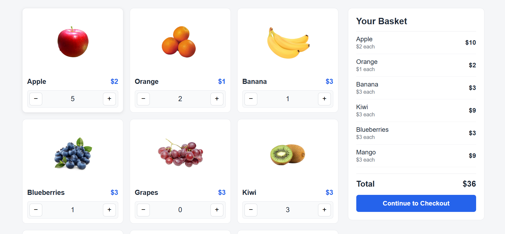

# Shopping Cart

A simple fruit shopping cart built with HTML, CSS and vanilla JavaScript. Pick the quantity of each fruit and the basket updates right away with the price of each item and the total.

**Live demo:** [js-e-commerce-cart](https://piyushdhakad001.github.io/js-e-commerce-cart/)



## Features

- Shows fruits with image, name and price
- + and − buttons to change the quantity of each fruit
- Basket updates live as you change quantities
- Each basket row shows the price per item and the total for that item
- Total amount is recalculated on every change
- A fruit disappears from the basket when its quantity goes back to 0

## Built With

- HTML
- CSS
- JavaScript (no libraries or frameworks)

## Project Structure

```
js-e-commerce-cart/
├── index.html
├── style.css
├── script.js
└── Images/
    ├── apple.jpg
    ├── orange.jpg
    └── ...
```

## How to Run

1. Clone the repository
```
   git clone https://github.com/piyushdhakad001/js-e-commerce-cart.git
```
2. Open the folder
```
   cd js-e-commerce-cart
```
3. Open `index.html` in your browser

No installation needed.

## How It Works

- The fruits are stored in an array of objects in `script.js` (id, image, name, price).
- Each fruit card is created with JavaScript from that array.
- Clicking + or − updates that fruit's quantity and adds it to, or updates it in, the `selectedProduct` array.
- The basket and the total are rendered again from `selectedProduct` after every click.

## What I Learned

- Creating and updating DOM elements with JavaScript
- Keeping the data in sync between two parts of the page
- Using `find()` to check if an item is already in an array
- Laying out a page with CSS flexbox and grid

## Future Improvements

- Save the basket in localStorage
- Make the "Continue to Checkout" button work
- Add a remove button in the basket
- Improve the layout for mobile screens